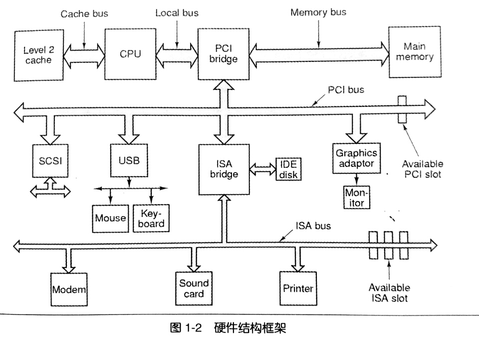

# 温故而知新

## 从helloworld说起

本书的目的，就是解释程序从编译、静态链接到操作系统如何装载程序、动态链接及运行库和标准库的实现。把Helloworld的运行机制解释清楚。

```c
#include<stdio.h>
int main()
{
  printf("helloworld\n");
  return 0;
}
```

## 万变不离其宗

抛开各种纷繁复杂的计算机组成设备，站在软件开发者的角度，我们只需要重点关注三个部件，分别是CPU、内存和I/O控制芯片。其他的硬件细节都被更高级的开发平台所抽象。

早期的计算机频率不高，由总线(Bus)连接所有的设备。

随着计算机的发展，CPU的频率、内存频率以及磁盘鼠标等设备的频率开始分化，由此发展出了：南桥(Southbridge)芯片专门连接低速设备，和北桥(Northbridge)芯片连接高速设备。



如图即采用PCI/ISA南北桥设计的硬件框架图。

### SMP与多核

因CPU工艺限制，频率难以突破4Ghz的天花板，制造商只好从CPU的数量入手提升性能。

对称多处理器(SMP,Symmetrical Multi-Processing)即让一个计算机拥有多个处理器，其功能地位相等，因此称为对称。

接着制造商为了降低成本，把产品推向PC，便把多个处理器“合并在一起打包出售”，合并后的处理器共享缓存部件，称为多核处理器(Multi-core Processor)。(当然还有其他细节上的不同)

值得一提的是增加的CPU数量并不与性能提升成正比。书中用了一个很好的比喻：一个女人可以花10个月生出一个孩子，但10个女人并不能在一个月生出一个孩子。

## 站得高，望得远

有人说过一句名言

> Any problem in computer science can be solved by another layer of indirection

计算机系统软件体系严格遵守层次设计的方法。

每个层次之间相互通信的协议称为接口(Interface)，应用程序也提供编程接口(application programming interface,API)。

运行库使用操作系统提供的系统调用接口(system call interface)，系统接口在实现中往往以软件中断(software interrupt)的方式提供。而操作系统调用硬件的接口，被叫做硬件规格(hardware specification)。

## 操作系统

操作系统提供抽象的接口和管理硬件资源。

在多任务系统(multi-tasking)中，操作系统接管了所有的硬件资源，并且本身运行在一个受硬件保护的级别。所有应用以进程(process)的方式运行在比操作系统权限更低的级别，进程之间地址空间相互隔离。

